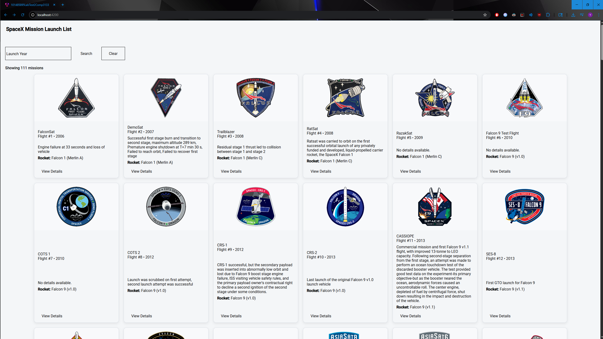
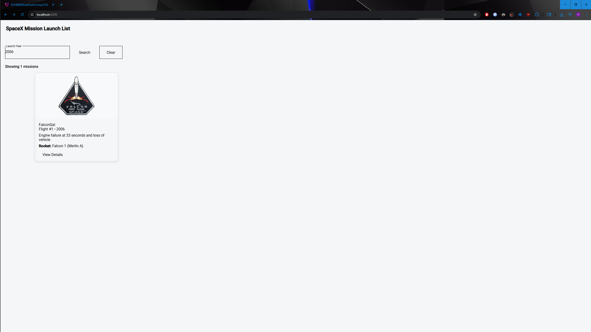
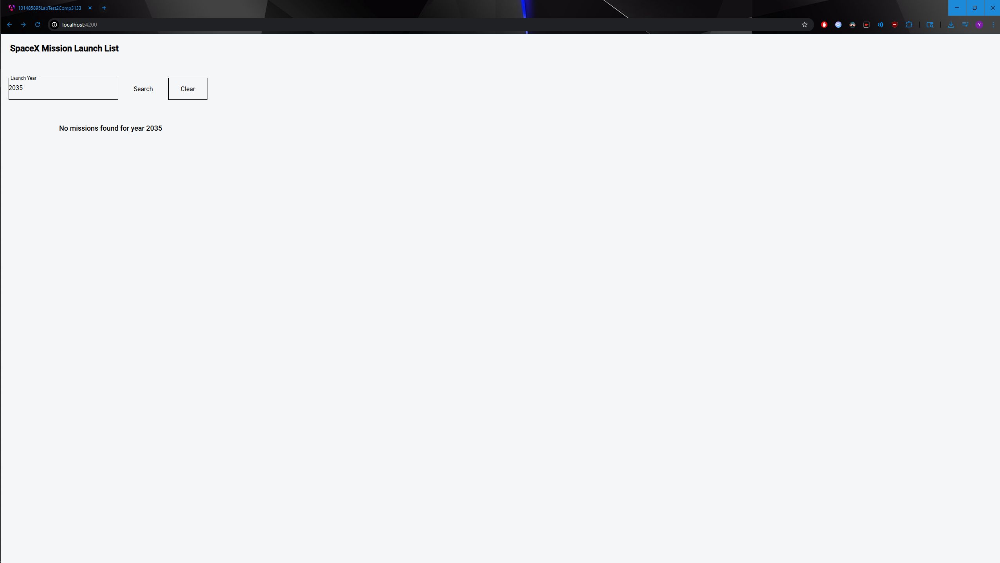
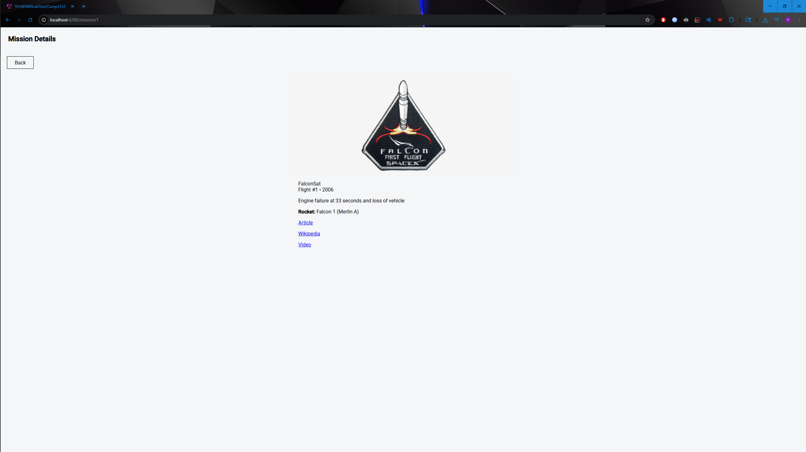

# 101485895-lab-test2-comp3133
# Laurence Liang

## Description
This Angular application uses the SpaceX API to display mission launches, filter them by launch year, and view mission details.

## Features
- View all SpaceX launches
- Filter missions by launch year
- View detailed information for a selected mission

## Technologies Used
- Angular
- TypeScript
- Angular Material
- SpaceX REST API

## Screenshots

### Mission List

### Filtered Missions

### No Results Found

### Mission Details
